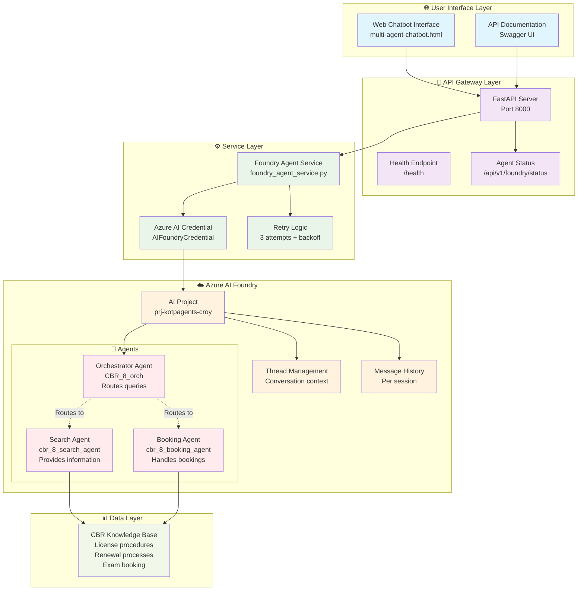
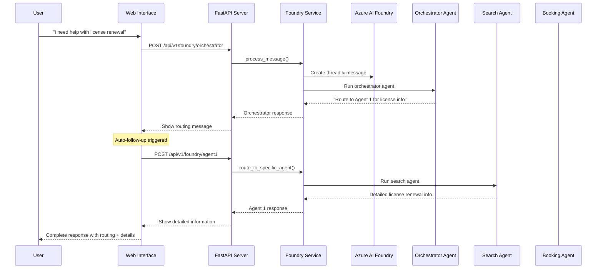

# CBR Multi-Agent Architecture - Demo Block Diagram

## 🏗️ **System Architecture Overview**

## 🔄 **Message Flow Diagram**

## 🎯 **Key Architecture Features**

### **1. Smart Routing System**
- **Orchestrator** analyzes user queries
- **Automatically routes** to appropriate specialist agent
- **Dual response** system (routing + detailed info)

### **2. Reliability Features**
- **Retry Logic**: 3 attempts with 2-second backoff
- **Fallback System**: Mock responses if all attempts fail
- **Thread Recovery**: Creates new threads on retry
- **Health Monitoring**: Real-time agent status

### **3. Azure AI Integration**
- **Real-time Connection**: Direct integration with Azure AI Foundry
- **Thread Management**: Maintains conversation context
- **Message History**: Persistent across sessions
- **Authentication**: Secure token-based access

### **4. User Experience**
- **Consistent Formatting**: Markdown rendering for all responses
- **Agent Identification**: Clear indication of which agent responded
- **Response Times**: Performance metrics displayed
- **Auto-routing**: Seamless experience with automatic follow-ups

## 📋 **Demo Script Points**

### **Show Real-time Architecture**
1. **User Query** → Web interface
2. **API Processing** → FastAPI logs
3. **Azure Integration** → Agent status check
4. **Orchestrator Routing** → Shows routing decision
5. **Agent Response** → Detailed information
6. **Formatted Display** → Professional presentation

### **Highlight Key Benefits**
- ✅ **Real Azure AI agents** (not mock responses)
- ✅ **Intelligent routing** based on query type
- ✅ **Comprehensive responses** with proper formatting
- ✅ **Reliable operation** with retry mechanisms
- ✅ **Scalable architecture** for additional agents

## 🚀 **Live Demo URLs**
- **Web Interface**: http://localhost:8000/static/multi-agent-chatbot.html
- **API Docs**: http://localhost:8000/docs
- **Agent Status**: http://localhost:8000/api/v1/foundry/status
- **Health Check**: http://localhost:8000/health

---

*This architecture demonstrates a production-ready multi-agent system built with Azure AI Foundry, featuring intelligent routing, comprehensive error handling, and professional user experience.*