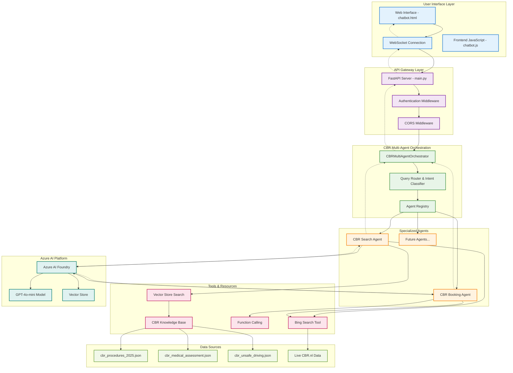
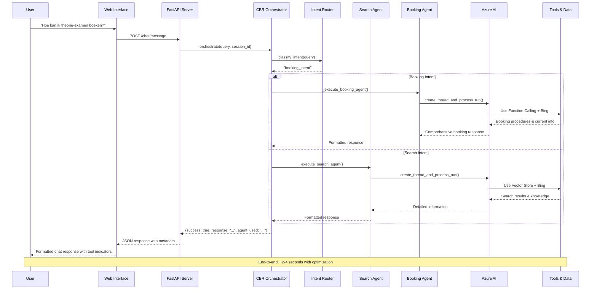
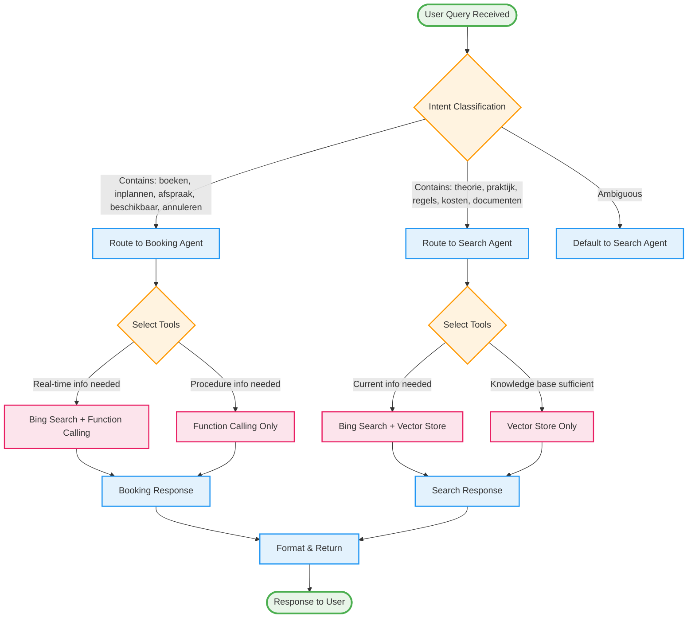
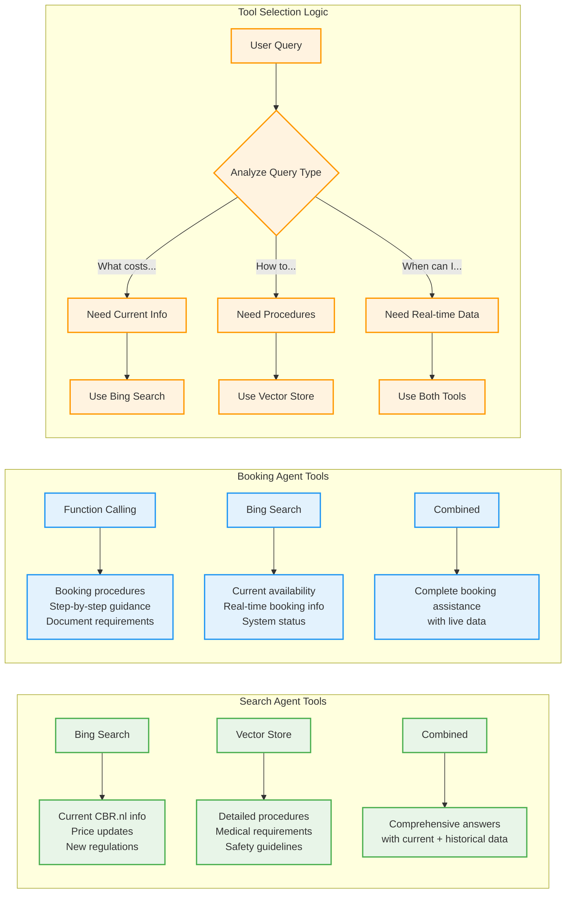
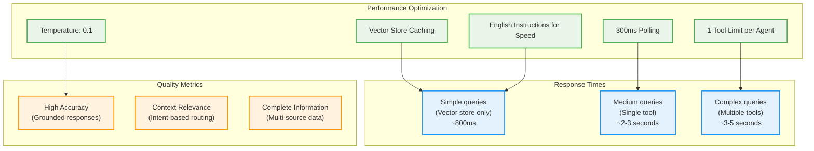
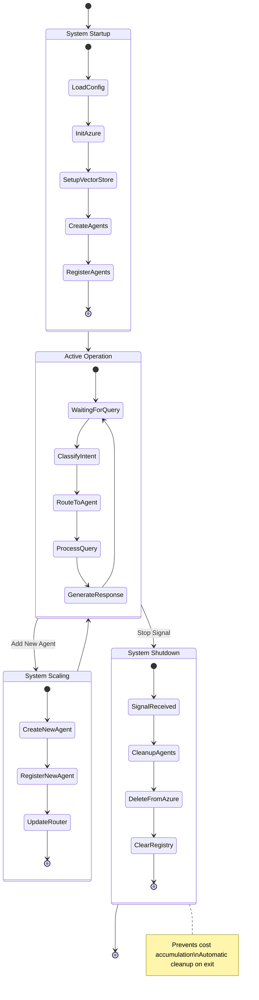

# CBR Multi-Agent System - Functional Diagram

## 🎯 System Overview: How It All Works Together

## 🔄 Request Processing Flow

## 🎯 Agent Decision Tree

## 🛠️ Tool Selection Strategy

## 📊 System Performance & Optimization

## 🔄 Agent Lifecycle Management

## 🎯 Key Functional Features

### **1. Intelligent Routing**
- **Intent Classification**: Automatically determines if query is about booking or general CBR information
- **Tool Selection**: Each agent uses appropriate tools based on query requirements
- **Fallback Handling**: Default routing ensures no query goes unanswered

### **2. Multi-Source Information**
- **Real-time Data**: Bing search for current CBR.nl information
- **Knowledge Base**: Vector store with comprehensive CBR procedures
- **Combined Responses**: Merges current and historical data for complete answers

### **3. Scalable Architecture**
- **Dynamic Agent Addition**: `add_agent()` function for runtime scaling
- **Independent Operation**: Agents operate without affecting others
- **Modular Design**: Easy to add new specializations

### **4. Cost Management**
- **Automatic Cleanup**: Signal handlers ensure agents are deleted on shutdown
- **Optimized Performance**: Caching and limits reduce Azure costs
- **Resource Monitoring**: Track agent usage and lifecycle

### **5. User Experience**
- **Fast Responses**: Optimized for 2-4 second response times
- **Tool Transparency**: Users see which tools provided information
- **Consistent Interface**: Unified chat experience regardless of agent used

This functional diagram shows exactly how your CBR multi-agent system processes requests, makes decisions, and delivers intelligent responses to users! 🚀