# CBR Multi-Agent System - Class Diagram

## 🎯 System Architecture Overview

## 🔗 Component Relationships

### **1. Main Orchestrator (`CBRMultiAgentOrchestrator`)**
- **Purpose**: Central hub that manages all agents and routes queries
- **Responsibilities**:
  - Initialize Azure AI client and vector stores
  - Create and manage specialized agents (Search & Booking)
  - Route user queries to appropriate agents based on intent
  - Handle agent lifecycle and cleanup
  - Provide system scaling capabilities

### **2. Enhanced Booking Agent (`CBRBookingAgentEnhanced`)**
- **Purpose**: Specialized agent for handling booking and scheduling queries
- **Key Features**:
  - Intent classification (10+ booking scenarios)
  - Real-world booking procedures and costs
  - Comprehensive CBR location and requirement data
  - Advanced query processing with context enhancement

### **3. Azure AI Integration Layer**
- **Components**: `AIProjectClient`, `Agent`, `ToolResources`
- **Purpose**: Interface with Azure AI Foundry for agent management
- **Capabilities**: Agent creation, thread management, tool integration

## 🎯 Data Flow Architecture

## 🛠️ Tool Architecture

## 📊 Configuration & Knowledge Models

```mermaid
classDiagram
    class SystemConfiguration {
        +azure_endpoint: str
        +subscription_id: str
        +resource_group: str
        +project_name: str
        +deployment_name: str
    }
    
    class BookingConfiguration {
        +theory_exam_cost: 38.35€
        +practical_exam_cost: 91.65€
        +15_cbr_locations: List
        +booking_deadlines: Dict
        +required_documents: Dict
    }
    
    class KnowledgeBase {
        +procedures_2025: JSON
        +medical_assessment: JSON
        +unsafe_driving: JSON
        +booking_steps: Dict
        +common_issues: Dict
    }
    
    SystemConfiguration --> CBRMultiAgentOrchestrator
    BookingConfiguration --> CBRBookingAgentEnhanced
    KnowledgeBase --> CBRMultiAgentOrchestrator
```

## 🔄 Lifecycle Management

## 🎯 Key Design Patterns

### **1. Orchestrator Pattern**
- Central coordinator manages multiple specialized agents
- Query routing based on intent classification
- Unified response interface

### **2. Factory Pattern**
- Dynamic agent creation with configuration
- Standardized agent initialization
- Scalable agent addition via `add_agent()`

### **3. Strategy Pattern**
- Different processing strategies for booking vs search queries
- Tool selection based on agent type
- Context-aware response generation

### **4. Observer Pattern**
- Signal handlers for graceful shutdown
- Automatic cleanup on system exit
- Lifecycle event management

## 🔧 Integration Points

1. **Azure AI Foundry**: Primary AI platform integration
2. **Vector Store**: CBR knowledge base with 3 JSON files
3. **Bing Search**: Real-time CBR.nl information
4. **DigiD Integration**: Authentication for booking procedures
5. **CBR.nl API**: (Future) Direct booking system integration

## 📈 Scalability Features

- **Agent Registry**: Dynamic agent management
- **Add Agent Function**: Runtime agent addition
- **Modular Tool System**: Plug-and-play tool architecture
- **Configuration-Driven**: Easy deployment across environments
- **Resource Management**: Automatic cleanup prevents cost accumulation

This architecture provides a robust, scalable foundation for your CBR multi-agent system with clear separation of concerns and comprehensive booking capabilities! 🚀